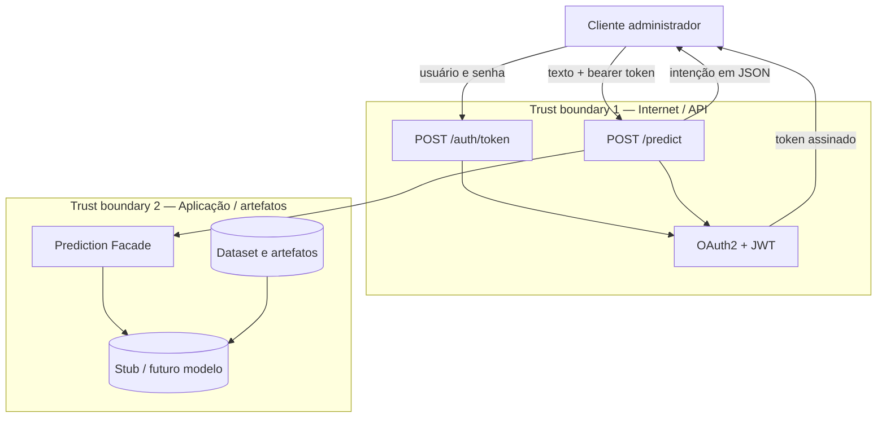

# DFD básico e análise CIA

Este documento é o esqueleto do modelo de ameaças do TP. Atualize-o quando o modelo de ML ou um
agente forem incorporados.

## Fluxo de dados e trust boundaries

### Entradas

- Credenciais OAuth2 no formulário de `/auth/token`.
- Texto livre e token Bearer em `/predict`.
- Dataset local e, futuramente, artefatos do modelo.

### Saídas

- JWT assinado com expiração.
- Estado de saúde da API.
- Intenção simulada em JSON.

### Trust boundaries

1. **Internet → API:** toda entrada é não confiável; requer TLS no ambiente publicado, validação,
   autenticação e limites de requisição.
2. **API → dados/modelo:** arquivos podem ser adulterados ou substituídos; exigem controle de
   acesso, procedência e verificação de integridade.

## Tríade CIA

| Componente | Confidencialidade | Integridade | Disponibilidade |
| --- | --- | --- | --- |
| Cliente administrador | Proteger senha e token contra exposição | Evitar alteração da requisição em trânsito | Conseguir autenticar e consultar a API |
| `/auth/token` | Não registrar senha; resposta só ao solicitante | Validar credenciais e emitir claims corretas | Resistir a abuso e tentativas repetidas |
| Chave e serviço JWT | Chave de assinatura é segredo crítico | Algoritmo, assinatura e expiração não podem ser alterados | Validação deve funcionar durante a operação da API |
| `/predict` | Não expor texto do ticket ou token em logs | Validar esquema, identidade e resposta | Manter latência e limites aceitáveis |
| Facade/modelo | Proteger parâmetros e regras internas quando sensíveis | Modelo e versão usados devem ser os aprovados | Prever fallback/health check em etapas futuras |
| Dataset/artefatos | Restringir acesso a nome, e-mail e texto livre | Preservar arquivo original e rastrear transformações | Garantir leitura para análise e inferência autorizadas |

## Controles já presentes no esqueleto

- `/predict` exige `OAuth2PasswordBearer` e JWT válido.
- Token possui `sub`, `iat` e `exp`, e aceita apenas o algoritmo configurado.
- Texto de entrada tem remoção de espaços e limite de tamanho.
- Contratos de entrada e saída usam Pydantic.
- Credenciais incorretas não informam qual campo falhou.

## TODO antes da entrega final

- Adicionar ameaça, impacto, probabilidade e mitigação para cada fluxo.
- Registrar rate limiting, TLS e política de logs do ambiente de execução.
- Definir checksum/versionamento para dataset e futuro modelo.
- Revisar o DFD quando houver banco, agente, LLM ou serviço externo.

